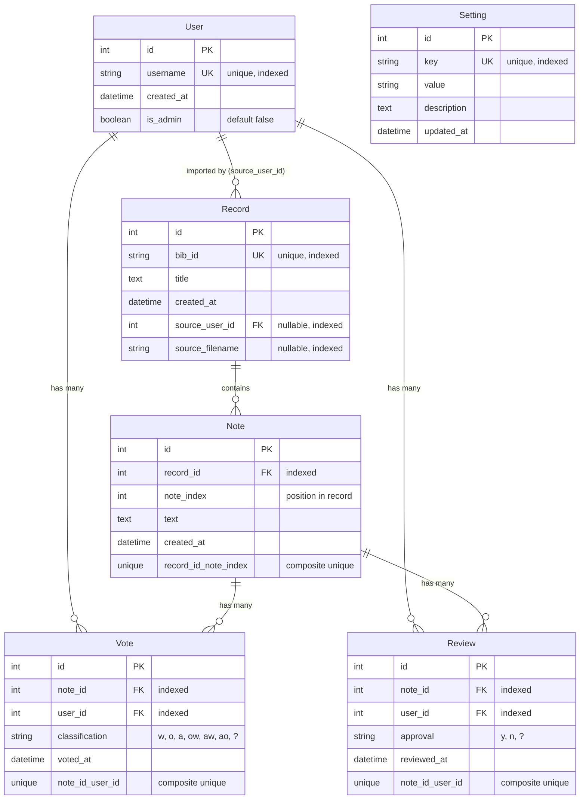

# Database Schema (ER Diagram)

## Purpose
Entity-relationship diagram showing all database tables, their fields, relationships, and constraints.

## Diagram



## Entity Descriptions

### User
Represents users who can vote on note classifications.

**Fields**:
- `id`: Primary key
- `username`: Unique username (max 50 chars), indexed for fast lookups
- `created_at`: Timestamp when user account was created
- `is_admin`: Boolean flag indicating admin privileges (auto-granted for "Admin" username)

**Relationships**:
- One-to-many with Vote (a user can vote on many notes)
- One-to-many with Review (a user can review many notes)
- One-to-many with Record via `source_user_id` (tracks which user imported records)

**Constraints**:
- `username` must be unique
- Username length limited to 50 characters

### Record
Represents a manuscript record containing multiple notes.

**Fields**:
- `id`: Primary key
- `bib_id`: Unique bibliographic identifier (max 50 chars), indexed
- `title`: Full title text
- `created_at`: Timestamp when record was created
- `source_user_id`: Foreign key to User who imported this record (nullable)
- `source_filename`: Filename of XML file from which record was imported (nullable, indexed)

**Relationships**:
- One-to-many with Note (a record contains many notes)
- Many-to-one with User via `source_user_id` (optional, tracks import source)

**Constraints**:
- `bib_id` must be unique
- `source_user_id` references `users.id` (foreign key constraint)

**Indexes**:
- `bib_id` (unique index)
- `source_user_id` (index for join performance)
- `source_filename` (index for filtering by source)

### Note
Represents an individual note within a record that can be classified.

**Fields**:
- `id`: Primary key
- `record_id`: Foreign key to Record
- `note_index`: Position of note within record (0-based)
- `text`: Full text content of the note
- `created_at`: Timestamp when note was created

**Relationships**:
- Many-to-one with Record (belongs to one record)
- One-to-many with Vote (can have many votes)
- One-to-many with Review (can have many reviews)

**Constraints**:
- Composite unique constraint: `(record_id, note_index)` ensures no duplicate note positions
- `record_id` references `records.id` (foreign key with cascade delete)

**Indexes**:
- `record_id` (indexed for fast filtering)
- Composite index on `(record_id, note_index)` for unique constraint

### Vote
Represents a user's classification vote on a note.

**Fields**:
- `id`: Primary key
- `note_id`: Foreign key to Note
- `user_id`: Foreign key to User
- `classification`: Classification type (w, o, a, ow, aw, ao, ?)
- `voted_at`: Timestamp when vote was cast (updated on vote changes)

**Relationships**:
- Many-to-one with Note (belongs to one note)
- Many-to-one with User (cast by one user)

**Constraints**:
- Composite unique constraint: `(note_id, user_id)` ensures one vote per user per note
- `classification` must be one of: w, o, a, ow, aw, ao, ?
- `note_id` references `notes.id` (cascade delete)
- `user_id` references `users.id` (cascade delete)

**Indexes**:
- `note_id` (indexed for vote distribution queries)
- `user_id` (indexed for user vote queries)
- Composite index on `(note_id, user_id)` for unique constraint

### Review
Represents a user's review/approval of a note classification (defined but may not be fully utilized).

**Fields**:
- `id`: Primary key
- `note_id`: Foreign key to Note
- `user_id`: Foreign key to User
- `approval`: Approval status (y, n, ?)
- `reviewed_at`: Timestamp when review was created

**Relationships**:
- Many-to-one with Note (reviews one note)
- Many-to-one with User (reviewed by one user)

**Constraints**:
- Composite unique constraint: `(note_id, user_id)` ensures one review per user per note
- `approval` must be one of: y, n, ?
- `note_id` references `notes.id` (cascade delete)
- `user_id` references `users.id` (cascade delete)

**Indexes**:
- `note_id` (indexed)
- `user_id` (indexed)
- Composite index on `(note_id, user_id)` for unique constraint

### Setting
Stores configurable system settings.

**Fields**:
- `id`: Primary key
- `key`: Setting key (unique, indexed)
- `value`: Setting value (stored as string)
- `description`: Human-readable description
- `updated_at`: Timestamp when setting was last updated

**Relationships**:
- None (standalone configuration table)

**Constraints**:
- `key` must be unique

**Common Settings**:
- `contentious_threshold`: Minimum consensus probability to avoid contentious marking (default: 0.70)
- `min_votes_contentious`: Minimum votes required before marking as contentious (default: 3)

## Key Design Decisions

### Composite Unique Constraints
- **Note**: `(record_id, note_index)` ensures notes are uniquely positioned within records
- **Vote**: `(note_id, user_id)` ensures one vote per user per note (allows vote updates)
- **Review**: `(note_id, user_id)` ensures one review per user per note

### Cascade Deletes
- Deleting a User cascades to delete all their Votes and Reviews
- Deleting a Record cascades to delete all its Notes (which cascade to Votes/Reviews)
- Deleting a Note cascades to delete all its Votes and Reviews

### Indexing Strategy
- Foreign keys are indexed for join performance
- Unique fields are indexed automatically
- Composite indexes support unique constraints and query performance
- `source_filename` indexed for admin filtering by import source

### Nullable Fields
- `source_user_id` and `source_filename` are nullable to support records imported before these fields existed
- Allows tracking import metadata without requiring it

## Query Patterns

### Common Queries

**Get all votes for a note**:
```sql
SELECT * FROM votes WHERE note_id = ?
```

**Get user's vote on a note**:
```sql
SELECT * FROM votes WHERE note_id = ? AND user_id = ?
```

**Get all notes for a record**:
```sql
SELECT * FROM notes WHERE record_id = ? ORDER BY note_index
```

**Get records imported by a user**:
```sql
SELECT * FROM records WHERE source_user_id = ?
```

**Get notes with identical text**:
```sql
SELECT * FROM notes WHERE text = ?
```

## Migration History

- Initial schema: User, Record, Note, Vote, Review, Setting tables
- Migration `483f3c9c5048`: Added `source_user_id` and `source_filename` to Record table
