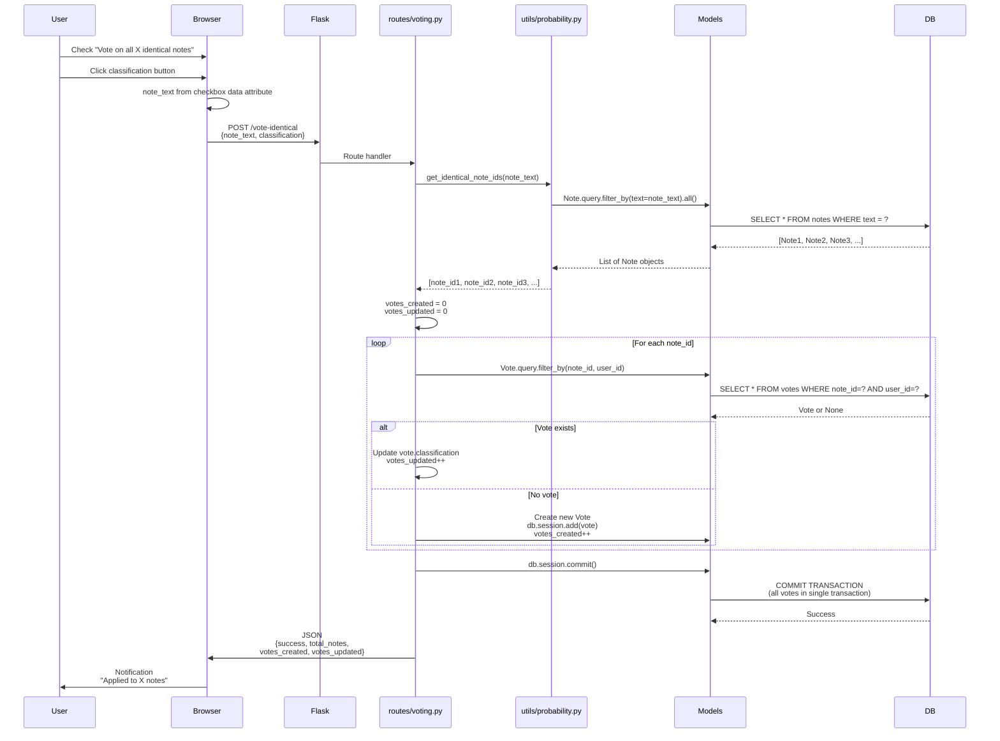
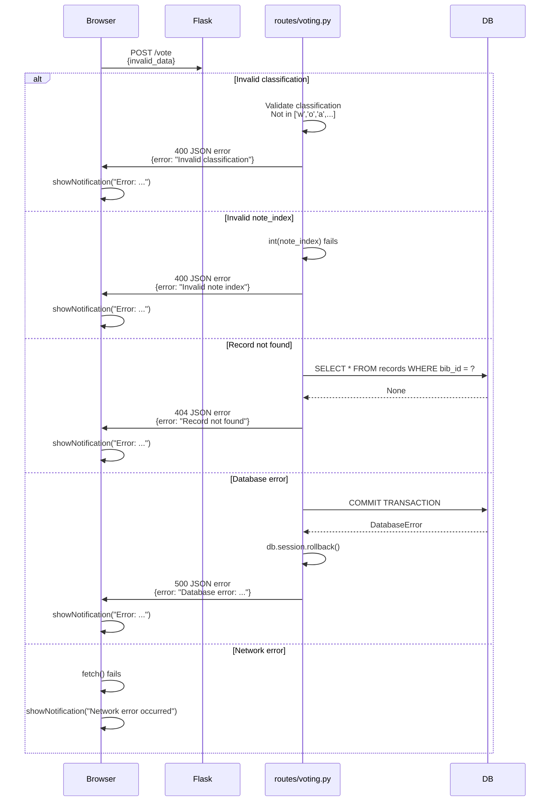

# Request Flow Diagram

## Purpose
Sequence diagram tracing a vote submission from browser click through the entire system to database persistence and UI update.

## Single Vote Submission Flow

```mermaid
sequenceDiagram
    participant User
    participant Browser as Browser<br/>(JavaScript)
    participant Flask as Flask App
    participant Auth as auth.py<br/>(Decorator)
    participant Voting as routes/voting.py
    participant Models as models.py<br/>(SQLAlchemy)
    participant DB as SQLite<br/>Database
    participant Utils as utils/probability.py
    participant UI as UI Update

    User->>Browser: Click classification button
    Browser->>Browser: Capture click event<br/>(noteIndex, classification)
    
    alt Bulk voting checkbox checked
        Browser->>Browser: Prepare note_text<br/>instead of note_index
        Browser->>Flask: POST /vote-identical<br/>{note_text, classification}
    else Single vote
        Browser->>Flask: POST /vote<br/>{bib_id, note_index, classification}
    end
    
    Flask->>Auth: @login_required decorator
    Auth->>Auth: Check session['username']
    
    alt Not logged in
        Auth->>Browser: 302 Redirect to /login
        Browser->>User: Show login page
    else Logged in
        Auth->>Voting: Proceed to route handler
        
        Voting->>Voting: Validate classification<br/>(must be: w,o,a,ow,aw,ao,?)
        Voting->>Voting: Validate note_index<br/>(convert to int)
        
        alt Bulk voting
            Voting->>Utils: get_identical_note_ids(note_text)
            Utils->>Models: Note.query.filter_by(text=note_text)
            Models->>DB: SELECT * FROM notes WHERE text = ?
            DB-->>Models: List of note IDs
            Models-->>Utils: [note_id1, note_id2, ...]
            Utils-->>Voting: List of note IDs
            
            Voting->>Voting: Loop through each note_id
        end
        
        Voting->>Models: Record.query.filter_by(bib_id=bib_id)
        Models->>DB: SELECT * FROM records WHERE bib_id = ?
        DB-->>Models: Record object
        Models-->>Voting: Record object
        
        alt Record not found
            Voting->>Browser: 404 JSON error
            Browser->>User: Show error notification
        else Record found
            Voting->>Models: Note.query.filter_by(record_id, note_index)
            Models->>DB: SELECT * FROM notes WHERE record_id=? AND note_index=?
            DB-->>Models: Note object
            Models-->>Voting: Note object
            
            alt Note not found
                Voting->>Browser: 404 JSON error
                Browser->>User: Show error notification
            else Note found
                Voting->>Models: Vote.query.filter_by(note_id, user_id)
                Models->>DB: SELECT * FROM votes WHERE note_id=? AND user_id=?
                DB-->>Models: Vote object or None
                Models-->>Voting: Existing vote or None
                
                alt Existing vote found
                    Voting->>Voting: Update existing vote<br/>(classification, voted_at)
                    Voting->>Models: db.session.commit()
                else No existing vote
                    Voting->>Models: Create new Vote object
                    Voting->>Models: db.session.add(vote)
                    Voting->>Models: db.session.commit()
                end
                
                Models->>DB: COMMIT TRANSACTION
                DB-->>Models: Success
                
                Voting->>Utils: calculate_vote_distribution(note_id)
                Utils->>Models: Vote.query.filter_by(note_id=note_id)
                Models->>DB: SELECT * FROM votes WHERE note_id = ?
                DB-->>Models: List of Vote objects
                Models-->>Utils: List of votes
                
                Utils->>Utils: Count votes by classification<br/>(Counter)
                Utils->>Utils: Calculate probabilities<br/>(count / total)
                Utils->>Utils: Determine consensus<br/>(highest count, alphabetical tie-break)
                
                Utils->>Models: Setting.query.filter_by(key='contentious_threshold')
                Models->>DB: SELECT * FROM settings WHERE key = ?
                DB-->>Models: Setting object
                Models-->>Utils: Threshold value (default 0.70)
                
                Utils->>Models: Setting.query.filter_by(key='min_votes_contentious')
                Models->>DB: SELECT * FROM settings WHERE key = ?
                DB-->>Models: Setting object
                Models-->>Utils: Min votes value (default 3)
                
                Utils->>Utils: Check if contentious<br/>(total >= min_votes AND<br/>consensus_probability < threshold)
                Utils-->>Voting: Distribution dict<br/>{votes, total, probabilities,<br/>consensus, consensus_probability,<br/>is_contentious}
                
                Voting->>Models: Vote.query.filter_by(note_id=note_id)<br/>.join(User)
                Models->>DB: SELECT votes.*, users.username<br/>FROM votes JOIN users<br/>WHERE note_id = ?
                DB-->>Models: List of Vote objects with User
                Models-->>Voting: List of votes with user data
                
                Voting->>Voting: Group voters by classification<br/>{'w': ['user1', 'user2'], ...}
                
                alt Bulk voting
                    Voting->>Voting: Count votes_created<br/>and votes_updated
                    Voting->>Browser: JSON response<br/>{success, classification,<br/>total_notes, votes_created,<br/>votes_updated}
                else Single vote
                    Voting->>Browser: JSON response<br/>{success, classification,<br/>distribution, consensus,<br/>consensus_probability,<br/>is_contentious, voters}
                end
                
                Browser->>Browser: Parse JSON response
                
                alt Bulk voting
                    Browser->>UI: Show notification<br/>"Vote applied to X notes"
                    Browser->>UI: Uncheck bulk checkbox
                else Single vote
                    Browser->>UI: updateVoteDisplay()<br/>(distribution, consensus)
                    Browser->>UI: updateVotersDisplay()<br/>(voters grouped by classification)
                    Browser->>UI: Highlight user's vote button
                    Browser->>UI: Show success notification<br/>"Consensus: W at 75%"
                end
                
                UI->>User: Updated UI displayed
            end
        end
    end
```

## Bulk Voting Flow (Detailed)

## Error Handling Flow

## Key Flow Characteristics

### Authentication Check
- Every vote request goes through `@login_required` decorator
- Session checked before any database operations
- Unauthenticated requests redirected to login

### Transaction Management
- Single vote: One transaction per vote
- Bulk vote: All votes committed in single transaction (atomic)
- Rollback on any error ensures data consistency

### Consensus Calculation
- Performed after vote is saved
- Queries all votes for the note
- Calculates probabilities and determines consensus
- Checks contentious threshold from Settings table

### UI Update Strategy
- AJAX prevents full page reload
- Dynamic DOM updates for vote distribution
- Button highlighting shows user's current vote
- Notifications provide immediate feedback

## Performance Considerations

### Database Queries
- **N+1 Query Risk**: Getting voters requires separate query (mitigated by join)
- **Eager Loading**: Notes loaded with votes using `joinedload()` in record detail view
- **Index Usage**: Foreign keys indexed for fast lookups

### Caching Opportunities
- Vote distributions could be cached (invalidate on vote updates)
- Identical note counts could be cached (invalidate on data import)
- Settings table queries could be cached (rarely change)

### Transaction Optimization
- Bulk voting uses single transaction for all notes
- Reduces database round-trips
- Ensures atomicity (all succeed or all fail)
