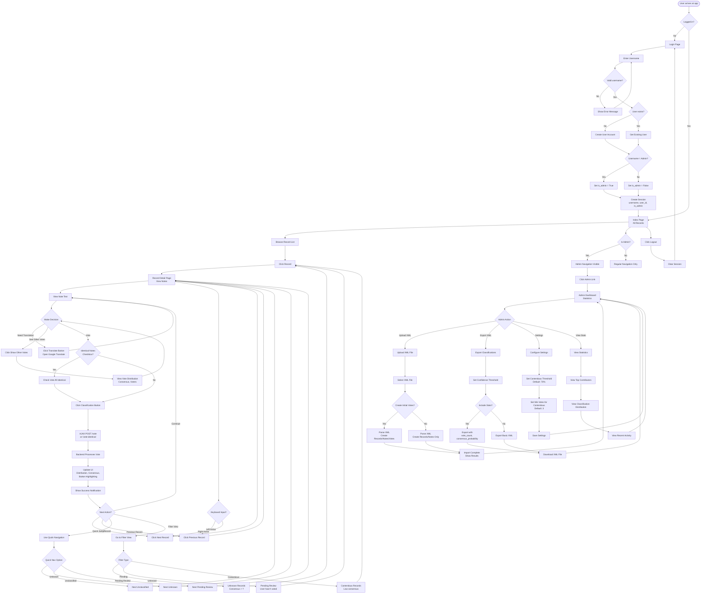
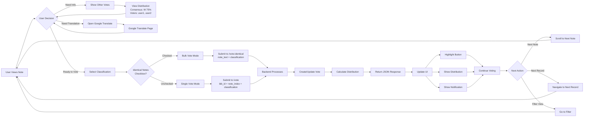
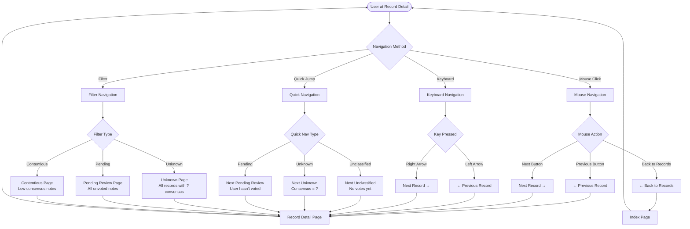
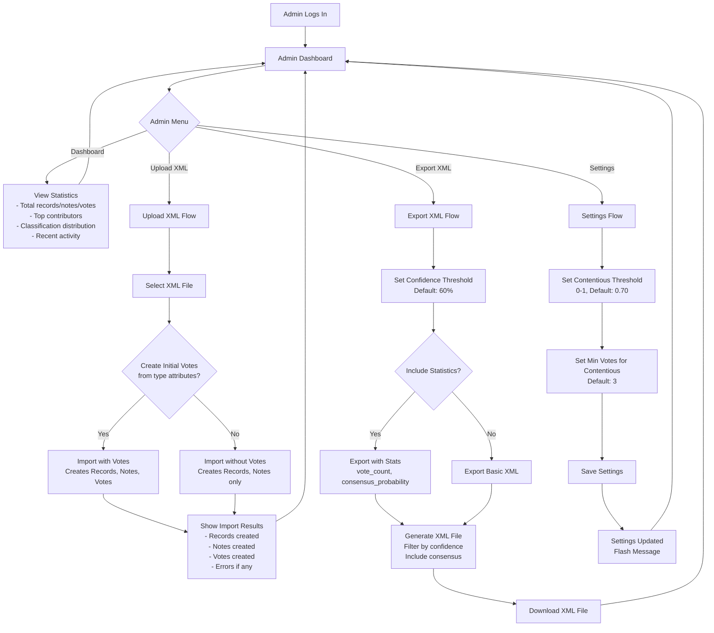
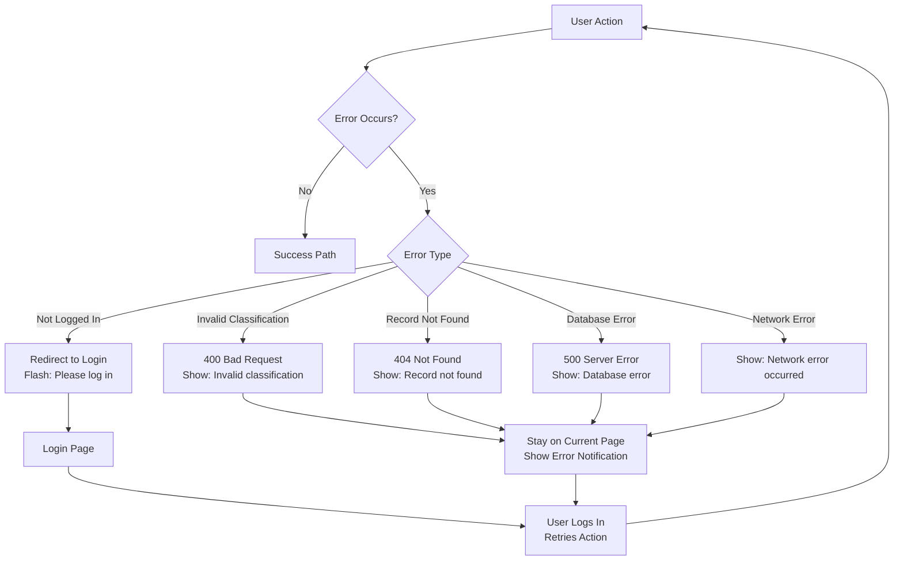

# User Journey Diagram

## Purpose
End-to-end user workflows showing how users interact with the system from login through various voting and navigation scenarios.

## Main User Flows

## Detailed Voting Flow

## Navigation Patterns

## Admin Workflows

## Error Scenarios

## User Journey Characteristics

### Regular User Journey
1. **Login** → Simple username entry, no password
2. **Browse** → View list of all records
3. **Classify** → Vote on notes, see consensus
4. **Navigate** → Use filters, quick navigation, keyboard shortcuts
5. **Review** → Check contentious notes, unknown classifications

### Admin User Journey
1. **Login** → Username "Admin" grants admin privileges
2. **Dashboard** → View statistics and activity
3. **Import** → Upload XML files to populate database
4. **Export** → Download classifications with confidence filtering
5. **Configure** → Adjust contentious thresholds and settings

### Key User Experience Features
- **Vote Privacy**: Other users' votes hidden by default
- **Bulk Voting**: Vote on all identical notes at once
- **Translation**: Quick access to Google Translate
- **Keyboard Navigation**: Arrow keys for quick movement
- **Quick Navigation**: Jump to next unclassified/unknown/pending
- **Filter Views**: Dedicated pages for specific note types
- **Progress Tracking**: Visual progress meter through records
- **Real-time Updates**: AJAX updates without page reload

## Decision Points

### When to Show Other Votes
- User clicks "Show Other Votes" button
- Votes are hidden by default to prevent bias
- Can toggle visibility on/off

### When to Use Bulk Voting
- Note has "X identical" badge
- User checks "Vote on all X identical notes"
- Applies vote to all notes with matching text

### When to Mark as Contentious
- Consensus probability < threshold (default 70%)
- Total votes >= min_votes (default 3)
- Visual badge displayed on note

### When to Export Notes
- Admin sets confidence threshold
- Only notes with consensus_probability >= threshold exported
- Optional statistics included in XML attributes
